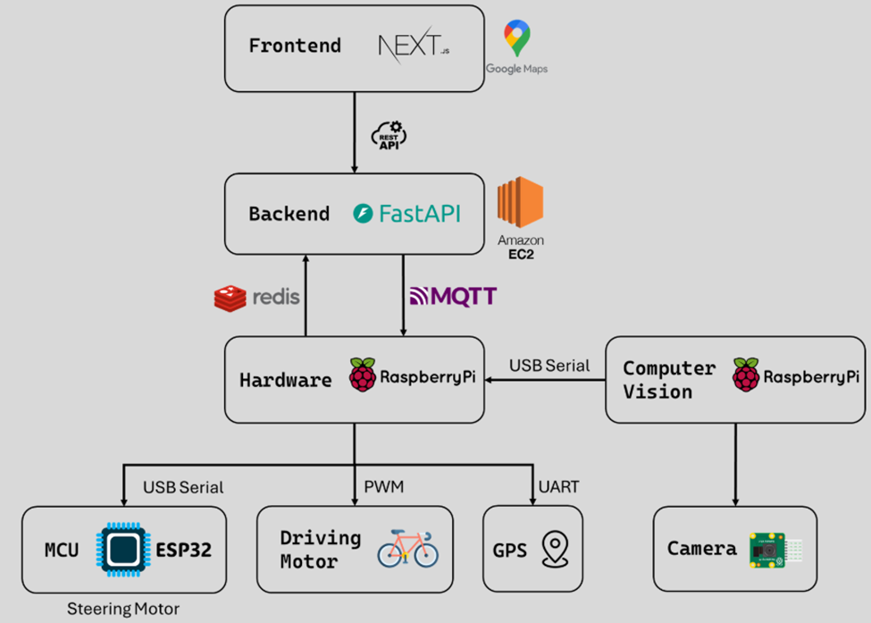
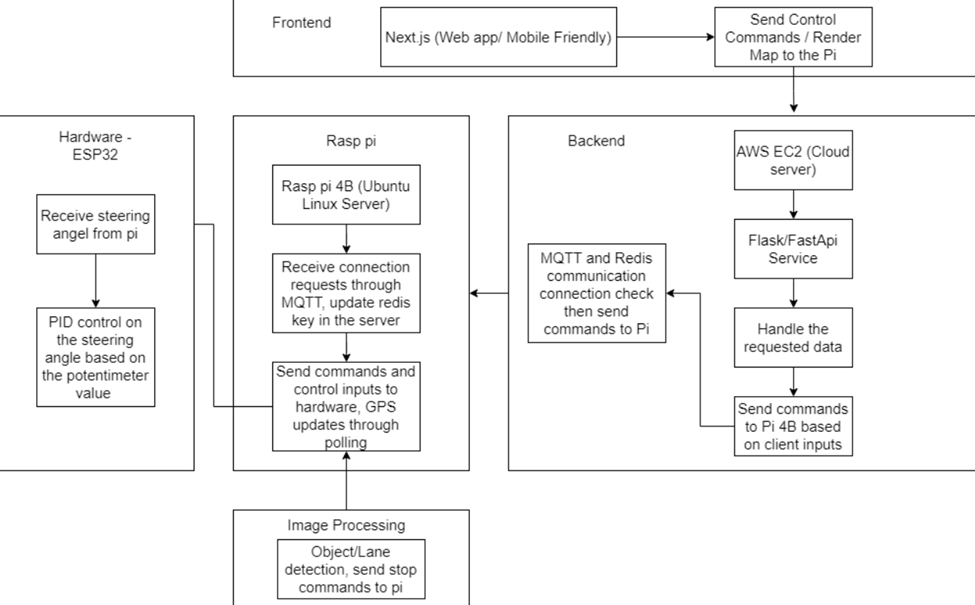
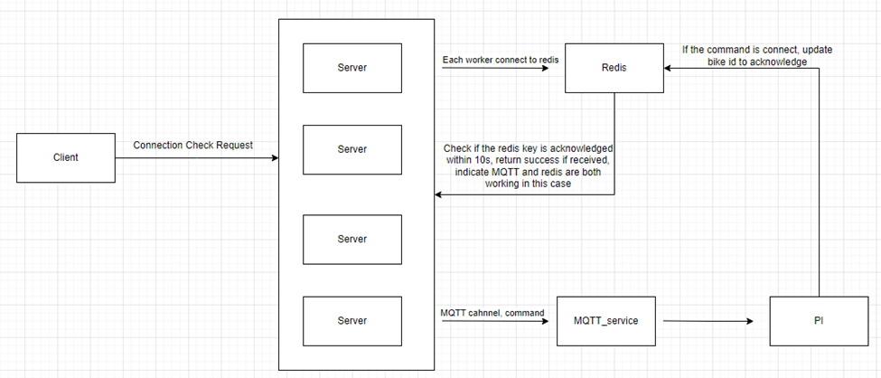

# Auto-Bike Backend

This is the backend server for the Autonomous Bike System developed by Group 17 for the ECE Capstone Project at McMaster University. The backend is responsible for managing communications between the web frontend, the GPS-enabled Raspberry Pi on the bike, and motor control systems via an ESP32 microcontroller. It provides APIs for navigation, status monitoring, and command transmission using both HTTP and MQTT protocols. The full report is available [here](https://drive.google.com/file/d/1rYNFWow4iSMQe98GnzFRXwHmZjyouQjB/view?usp=drive_link)

## Features

- 🌐 **FastAPI Server**: Lightweight, high-performance web framework used to expose RESTful APIs.
- 🛰️ **Real-Time GPS Data**: Receives GPS updates from the bike every 3 seconds and relays this to the frontend.
- 📡 **Bidirectional Communication**: Utilizes MQTT and Redis Pub/Sub to ensure reliable message delivery between the backend and Raspberry Pi.
- ⚙️ **Command Synchronization**: Implements a three-way handshake protocol to confirm command receipt and execution status.
- 📍 **Navigation Interface**: Integrates with Google Maps API to calculate routes and provides these to the bike.
- 🔒 **Secure & Scalable Hosting**: Deployed on an AWS EC2 instance with HTTPS enabled using Nginx and a valid SSL certificate.

## System Architecture

Overall Block Diagram:



Detailed Flowchart:



Three-Way Handshake Communication Design



## Tech Stack

- Python > 3.12
- FastAPI
- Redis
- MQTT (Mosquitto)
- Nginx (reverse proxy with HTTPS)
- AWS EC2 (Ubuntu Server)
- PM2 (process manager)

## Deployment Details

- ✅ **Deployed on AWS EC2 (Ubuntu Server)**
- 🛡️ **HTTPS Enabled**: SSL configured using Nginx for secure API access
- 🔧 **MQTT & Redis**: Internal communication managed using Redis Pub/Sub and MQTT protocol for real-time responsiveness
- 🚀 **Process Management**: `pm2` used for process monitoring and uptime assurance

##  API Overview

- `GET /latest-gps/{bike_id}` – Retrieves the latest GPS coordinates from the specified bike.
- `GET /test-bike-connection/{bike_id}` – Checks if the bike is currently connected to the backend.
- `POST /bike-response` – Receives a response from the bike confirming a command was executed.
- `POST /send-command` – Sends a movement or steering command to the bike.
- `POST /send-navigation` – Sends a calculated navigation route to the bike.

## How It Works

1. The frontend sends a user-defined route to the backend.
2. The backend processes the route and issues movement commands to the Raspberry Pi via MQTT/Redis.
3. The Pi interprets the commands and steers the bike accordingly using a PID control loop via ESP32.
4. GPS updates are posted to the backend, which are relayed back to the frontend every 3 seconds.

## Getting Started (Local Dev)

```
git clone https://github.com/Auto-Bike/backend.git
cd backend
pip install -r requirements.txt
uvicorn main:app --reload
```

## Authors

- Richard Qiu (Backend/Embedded System Lead)
- [Group 17 - ECE Capstone 2025]

